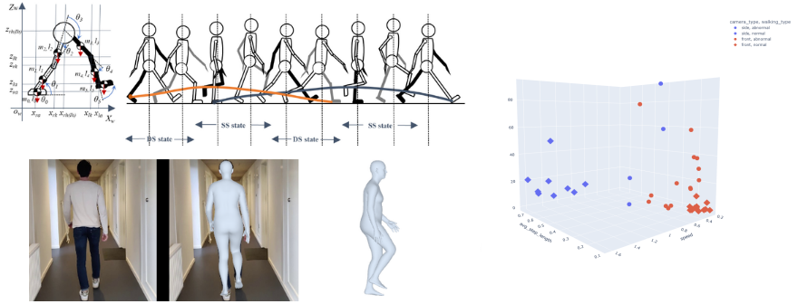

# Human Gait Analysis with Abnormality Detection with 4D Humans
Using Human Recognition Models to analyze an individuals walking gait for indications of abnormality, asymmetry and instability with an increased risk of falling.
This project is based on processing results of [4D-Humans](https://shubham-goel.github.io/4dhumans/) ([Paper](https://arxiv.org/pdf/2305.20091.pdf) and [Code](https://github.com/shubham-goel/4D-Humans)) and detecting abnormalities in an individuals walking style.




# Repo Overview

This repo is a fork of [4D-Humans](https://github.com/shubham-goel/4D-Humans) and uses 4D Humans and it's underlying models for tracking and recognizing individuals to then analyze their walking gait for indications of abnormality, instability and higher risk of falling.

```
/
├── bio_data/       -- Data and 4D Human outputs used in our analysis 
├── biomechanics/   -- Library for cleaning, processing and plotting
├── example_data/
├── hmr2/
├── notebooks/      -- Notebooks used for analysis, cleaning and processing
```
# Setup and Installtion
Follow the 4D-Humans setup first and use the 4D Humans environment to avoid different dependency versions.

## 4D-Humans Installation and Setup
See [README-4D-HUMANS.md](README-4D-Humans.md) for setting up 4D Humans.